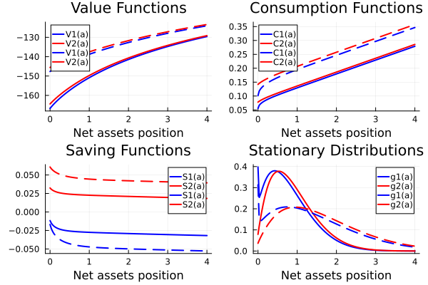
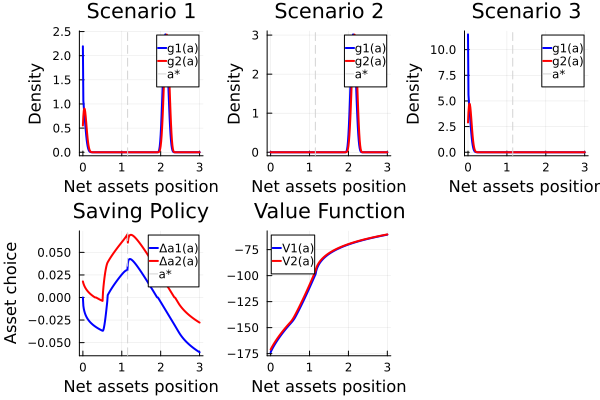

# Adchou_sample

This package reproduces some of the results in Adchou et al. (2022 RES) : Income and Wealth Distribution in Macroeconomics: A Continuous-Time Approach
https://benjaminmoll.com/wp-content/uploads/2019/07/HACT.pdf

It was prepared for the course Computational Econ by Florian Oswald. 
Course link : https://floswald.github.io/NumericalMethods/

I translate Matlab code from codes from Ben Moll's website: https://benjaminmoll.com/codes/ 

The paper presents continous-time methods for solving the steady-state of heterogeneous agents models in continuous time. The exposition focuses on a two-states Aiyagari model which is convenient to express closed forms. Continuous-time allows for analytical solutions and is more flexible than discrete-time. Solving for the SS is done by using Finite-Differencing. Computation is fast thanks to the sparsity of continuous-time transition matrix. The methods have a significantly broader applicability than just the Aiyagari model as illustated with a non-convex model featuring housing holdings. 

# How to install and run

Step 1: Download the package and open it as working directory in your favorite code editor (VSCode)

Step 2: Open Julia REPL and add the package by running 'add https://github.com/romgoti/Adchou_sample.jl' from the package prompt (type ])

Step 3: In the main julia prompt, run 'using Adchou_sample' and then the functions Adchou_sample.figure7() or Adchou_sample.figure10() to solve the model and plot the figures. You can also run the file 'figures/run.jl' to do the analysis manually.

# Results description

In this exercise, I reproduce figures 7 and 10 of the paper. 

Figure 7 : Consumption + saving policy functions and stationary distribution of wealth in a 2-states Aiyagari model

In the paper, figures 1, 6 and 7 show partial (exogenous r) equilibrium consumption function, saving function and stationary distribution. I replicate those by instead computing the stationary general equilibrium (endogenous r) but vary the productivity (A2 = A1*150%). I calibrate my model to obtain resembling figures, default parameter values can be found in solve.jl as default inputs of solve_2states().

My Figure 7 shows how increasing productivity allows for more utility for all agents. This can be seen in the (dashed) value functions being higher. Agents consume more in both idiosyncratic states. Note that the difference in consumption functions across states is quite low between states so the variance in utility is low (except close to the borrowing constraint a=0). In the high-productivity economy, savings are more volatile and workers hold on average more assets. 

Figure 10 : Consumption + saving + housing policy functions and stationary distribution of wealth for different scenarii in a 2-states non-convex Aiyagari model with a housing good

In the paper, figure 10 shows policy functions and stationary distributions. Agents can save in a housing good, but they need to make a down-payment to buy one unit of housing. This generates a poverty trap whereby HHS with low assets cannot affort to by housing until they reach a certain level of assets a*. I only keep the saving function, value function and stationary distributions. Note that non-convex probems have multiple stationary distributions because they are history-dependent. Also note that this is a partial equilibrium that takes as given the housing price and interest rate.

My figure 10 takes parameter values as in the replication file for comparability. The saving function shows how HHs can be stuck in a low-assets state. Since this policy function is convex-concave HHs that have low asset do not save until the point where they can buy housing: this is the poverty trap. The value functions show how steep is utility in this low part of the assets distributions compared to HHs that get past the poverty trap and are much more insured against idiosyncratic shocks. Finally, the top panels show 3 different stationary distributions. In scenario 1, some workers are in the poverty trap, in scenario 2 none and in scenario 3 all.
